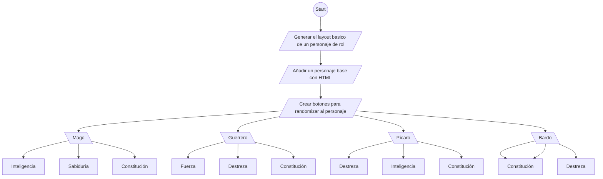

```mermaid
flowchart TD;
    A((Start))
    B[/Generar el layout basico de un personaje de rol/]
    C[/Añadir un personaje base con HTML/]
    D[/Crear botones para randomizar al personaje/]
    E[\Mago\]
    F[\Guerrero\]
    G[\Pícaro\]
    H[\Bardo\]
    MI[Inteligencia]
    MS[Sabiduría]
    MC[Constitución]
    GF[Fuerza]
    GD[Destreza]
    GC[Constitución]
    PD[Destreza]
    PI[Inteligencia]
    PC[Constitución]
    BC[Carisma]
    BD[Destreza]
    BC[Constitución]
    
    A --> B --> C --> D
    D --> E
    D --> F
    D --> G
    D --> H
    E --> MI
    E --> MS
    E --> MC
    F --> GF
    F --> GD
    F --> GC
    G --> PD
    G --> PI
    G --> PC
    H --> BC
    H --> BD
    H --> BC
```

You can find other templates and resources like this at the [school's GitHub page](https://github.com/4geeksacademy/).
